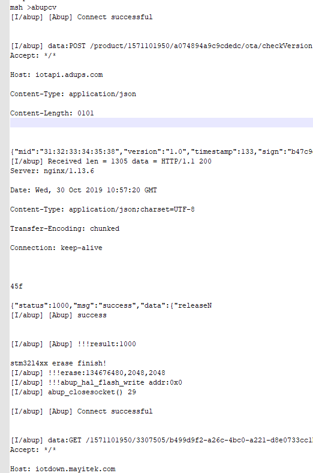
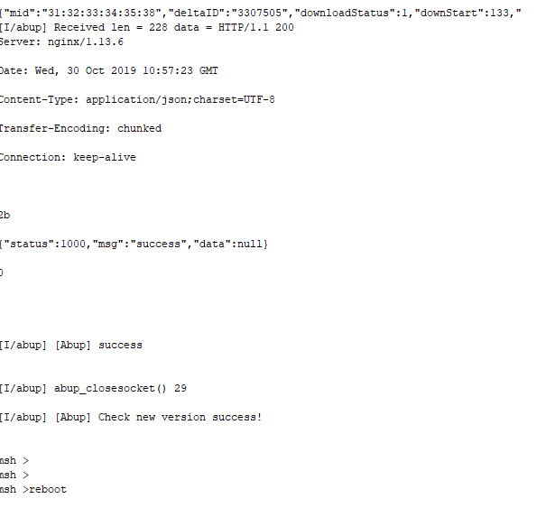
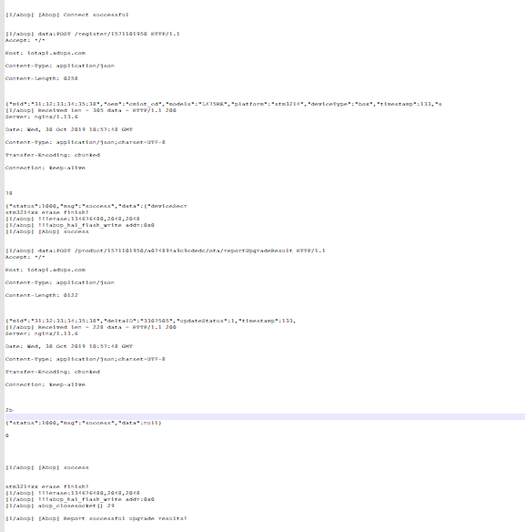

# Abup FOTA Downloader

## 1、介绍

本软件包是用于 Abup FOTA 升级的固件下载器

 - HTTP/CoAP 协议下载固件

### 1.1 许可证

Abup FOTA Downloader package 遵循 Apache2.0 许可，详见 `LICENSE` 文件。

### 1.2 依赖

- RT-Thread 3.0+
- FAL 软件包支持
- HTTP/CoAP 下载方式依赖于 TCP/UDP

## 2、如何打开 Abup FOTA Downloader

使用 Abup FOTA Downloader package 需要在 RT-Thread 的包管理器中选择它，具体路径如下：

```
       --- abup_fota: The firmware downloader which using on Abup FOTA component 
             Enable HTTP/CoAP FOTA (CoAP)  --->                                  
             Recover algorithm (wosun)  --->                                     
       [*]   Enable Abup FOTA Downloader debug                                   
       (Abup) Data area name                                                     
       (0x40) Flash minimum unit total                                           
       (0x00000800) Flash minimum unit size                                      
       (0x08000000) Flash start address                                          
       (0x00004000) Bootloader size                                              
       (0x10000) Application size                                                
       (0x08014000) Differential information address                             
       (0x08014800) Differential address                                         
       (0xB800) Differential package size                                        
       (G070RB) OEM                                                              
       (G070RB) Device Name                                                      
       (1562662709) Product ID                                                   
       (d42a103a639f4b5d94d97c3bd7bc9ba5) Product Secret                         
       (box) Device Type                                                         
       (stm32l0) Platform                                                        
       (1.0) firmware version                                                    
             Version (latest)  --->
```

软件包选项的详细说明如下图：

| 选项 | 说明 |
|-|-|
| Enable HTTP/CoAP FOTA (CoAP) | 选择固件下载器使用HTTP/CoAP协议 |
| Recover algorithm (wosun) | 做包信息配置还原算法wosun/lusun |
| Enable Abup FOTA Downloader debug | 使能固件下载器 debug 模式 |
| (Abup) Data area name | 下载分区名称 |
| (0x40) Flash minimum unit total              | flash最小单位总数 |
| (0x00000800) Flash minimum unit size              | flash最小单位大小 |
| (0x08000000) Flash start address                  | flash起始地址 |
| (0x00004000) Bootloader size                      | bootloader大小 |
| (0x10000) Application size                        | App大小 |
| (0x08014000) Differential information address     | 差分包信息地址 |
| (0x08014800) Differential address                 | 差分包地址 |
| (0xB800) Differential package size                | 差分包大小 |
| (G070RB) OEM                                      | OEM(艾拉比服务器上项目信息) |
| (G070RB) Device Name                              | 设备型号(艾拉比服务器上项目信息) |
| (1562662709) Product ID                           | Product ID(艾拉比服务器上项目信息) |
| (d42a103a639f4b5d94d97c3bd7bc9ba5) Product Secret | Product Secret(艾拉比服务器上项目信息) |
| (box) Device Type                                 | 设备类型(艾拉比服务器上项目信息) |
| (stm32l0) Platform                                | 平台(艾拉比服务器上项目信息) |

选择完自己需要的选项后使用 RT-Thread 的包管理器自动更新，或者使用 `pkgs --update` 命令更新包到 BSP 中。

## 3、使用 Abup FOTA Downloader

在打开 Abup FOTA Downloader package ，选中相应的功能选项后，当进行 BSP 编译时，它会被加入到 BSP 工程中进行编译。
烧录程序到目标开发板，用户可在 FinSH 终端找到对应的命令。目前软件包支持的升级方式如下表：

| 功能 | 函数调用 | 执行命令 |
|---|---|---|
| 使用 HTTP/CoAP 协议固件升级 | `void abupcv(void)` | `check new update` |
| 上报升级结果 | `abup_int abup_init_update_result(void)` | `report update result` |

### 3.1 检测新固件命令行演示

在终端输入 `abupcv` 命令后，：




### 3.2 上报升级结果

开机在main函数初始化fal之后运行abup_init_update_result函数：



## 4、注意事项

 1. 确保 FAL 中有 Abup 分区。
 2. 确保系统支持socket。
 3. 确保bootloader支持艾拉比还原算法。

## 5、参考资料

> 《RT-Thread OTA 用户手册》: docs/RT-Thread-OTA 用户手册.pdf

## 6、联系方式 & 感谢

* 维护：艾拉比开发团队
* 主页：https://github.com/RayShen1018/Abup
